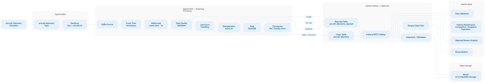
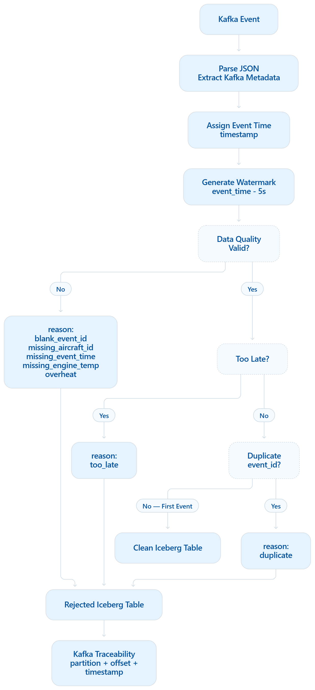
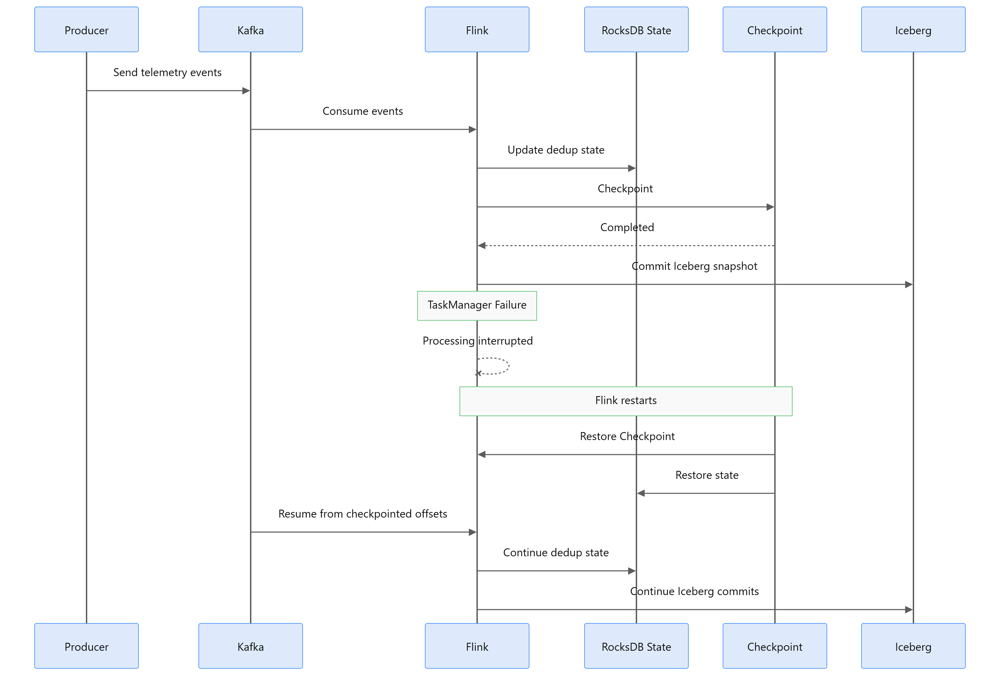

# Real-Time Aircraft Telemetry Lakehouse

> A production-style streaming lakehouse that demonstrates how a
> real-time data pipeline handles **late events, duplicate events,
> invalid sensor readings, stateful processing, checkpoint recovery, and
> traceable rejected data**.

This project simulates aircraft telemetry flowing through **Apache Kafka
→ Apache Flink → Apache Iceberg → Apache Spark**. Rather than focusing
only on the happy path, the pipeline is designed around reliability and
data quality: event-time processing, bounded lateness, deduplication,
rejected-record routing, Kafka traceability, and checkpoint-based state
recovery.

## Architecture



### End-to-end flow

1.  A Python producer generates telemetry for multiple aircraft.
2.  Kafka partitions events using `aircraft_id` as the message key.
3.  Flink SQL reads the stream and applies event-time semantics.
4.  A 5-second watermark tracks event-time progress.
5.  Data-quality rules identify missing fields and overheated readings.
6.  Late events are classified as accepted-late or too-late.
7.  Valid events are deduplicated by `event_id`.
8.  Clean and rejected records are committed to separate Iceberg tables.
9.  Iceberg uses a REST catalog with Parquet data stored in MinIO.
10. Spark reads the same Iceberg tables for validation, reconciliation,
    analysis, and maintenance.

## What this project demonstrates

- **Event-time processing** with a 5-second watermark
- **Bounded lateness** with an additional 15-second acceptance window
- **Stateful deduplication** by `event_id`
- **RocksDB state backend** for Flink stateful processing
- **30-second exactly-once Flink checkpoints**
- **Iceberg snapshot commits coordinated with successful checkpoints**
- **Data-quality routing** instead of silently discarding invalid
  business records
- **Kafka traceability** using partition, offset, and Kafka timestamp
- **Shared Iceberg REST catalog** accessed by Flink as `lakehouse` and
  Spark as `demo`
- **Spark validation and lakehouse maintenance**

## Flink processing flow



The pipeline first evaluates whether a record is valid. Invalid records
receive one or more rejection reasons. Records that pass those checks
are evaluated for lateness and then deduplicated by `event_id`.

---

Condition Result

---

Valid reading, first occurrence of `aviation.aircraft_telemetry`
`event_id`

Same `event_id` seen again within rejected with `reason = duplicate`
the 1-hour state TTL

`engine_temp > 1000` rejected with `reason = overheat`

Event time is more than 15 seconds rejected with `reason = too_late`
behind the current watermark

Event is behind the watermark but main table with `late = true`
within the 15-second tolerance

Blank `event_id`, missing aircraft, rejected with the corresponding
event time, or engine temperature reason

---

Multiple validation failures can be preserved on the same row, for
example:

```text
overheat,too_late
```

Rejected records retain:

```text
reason
kafka_partition
kafka_offset
kafka_timestamp
```

This makes rejected data observable and traceable back to its Kafka
source position.

## Event time and watermark


The source defines:

```sql
WATERMARK FOR event_time AS event_time - INTERVAL '5' SECOND
```

The project then applies a separate business rule:

```text
event_time >= watermark
    → normal event
    → clean table
    → late = false

watermark - 15s <= event_time < watermark
    → late but accepted
    → clean table
    → late = true

event_time < watermark - 15s
    → too late
    → rejected table
    → reason = too_late
```

The watermark represents **event-time progress**. It does not by itself
mean that every event behind the watermark is automatically rejected.
The additional 15-second rule defines how this pipeline handles late
data.

`table.exec.source.idle-timeout = '10 s'` prevents an idle Kafka
partition from indefinitely holding back the overall watermark.

## Stateful deduplication

Valid records are deduplicated using:

```sql
ROW_NUMBER() OVER (
    PARTITION BY event_id
    ORDER BY proc_time ASC
) AS rn
```

The first occurrence is written to the clean table. Later occurrences
within the retained state horizon are routed to the rejected table with:

```text
reason = duplicate
```

Flink uses **RocksDB state** to maintain the state required by stateful
operators such as deduplication.

The project configures:

```sql
SET 'state.backend.type' = 'rocksdb';
SET 'state.backend.incremental' = 'true';
SET 'table.exec.state.ttl' = '1 h';
```

The 1-hour TTL is important: this is **bounded deduplication**, not
permanent global deduplication. After the relevant state expires, an old
`event_id` may be treated as new.

## Checkpoint and failure recovery



Checkpointing and business deduplication solve different problems:

```text
RocksDB state
    → remembers state required by stateful processing

Flink checkpoint
    → snapshots processing state and source progress
    → enables recovery after failure

event_id deduplication
    → handles duplicate business events
```

The job uses:

```sql
SET 'execution.checkpointing.interval' = '30s';
SET 'execution.checkpointing.mode' = 'EXACTLY_ONCE';
```

Iceberg commits become visible after successful checkpoint-driven
commits, so with this demo configuration a newly processed row is not
necessarily visible to Spark immediately.

> **Important:** checkpoint-based exactly-once processing and
> business-level deduplication are not the same thing. Checkpoints
> protect processing consistency during failure/recovery; `event_id`
> state handles repeated business events.

## Data model

Example telemetry event:

```json
{
  "event_id": "7c2e0d2a-4f1b-4c0a-9a11-0b5e2d8c6f10",
  "aircraft_id": "AC-101",
  "timestamp": "2026-09-26T06:43:24.565Z",
  "telemetry": {
    "altitude": 10821.4,
    "speed": 854.2,
    "engine_temp": 688.1
  }
}
```

`event_time` comes from the JSON `timestamp` field.

The producer also injects test anomalies:

Fault Example behavior

---

Late moves event time backwards
Duplicate reuses a previous `event_id`
Overheat generates `engine_temp > 1000`

The temperature threshold is a **demo data-quality rule**, not an
aviation safety specification.

## Iceberg storage design

Flink writes two Iceberg tables:

```text
lakehouse.aviation.aircraft_telemetry
lakehouse.aviation.aircraft_telemetry_rejected
```

Spark accesses the same physical tables through its catalog name:

```text
demo.aviation.aircraft_telemetry
demo.aviation.aircraft_telemetry_rejected
```

Both catalogs point to the same Iceberg REST catalog and MinIO-backed
warehouse.

The tables use:

- Iceberg format v2
- Parquet
- Zstandard compression
- Iceberg snapshots and metadata
- MinIO as S3-compatible object storage

## Design decisions

### Why Kafka?

Kafka decouples telemetry producers from downstream processing and
provides partitioned, replayable event transport. Using `aircraft_id` as
the Kafka key keeps events for the same aircraft on the same Kafka
partition.

### Why event time?

Telemetry may arrive out of order because of network delay, buffering,
or upstream retries. Processing only by arrival time would hide that
distinction.

### Why a watermark?

The watermark gives Flink a notion of event-time progress while allowing
bounded out-of-order arrival.

### Why deduplicate by `event_id`?

Kafka ordering and business uniqueness are different concerns.
`aircraft_id` controls Kafka partition routing, while `event_id`
identifies the business event used for deduplication.

### Why RocksDB state?

Deduplication is stateful. Flink must remember previously observed event
IDs during the configured state horizon. RocksDB provides a state
backend suitable for maintaining larger keyed state than a purely
heap-oriented approach.

### Why Iceberg instead of plain Parquet?

Parquet is the physical file format. Iceberg adds table metadata,
snapshots, transactional table commits, schema evolution capabilities,
and table-level management on top of those files.

### Why keep rejected data?

Invalid or severely late data should remain inspectable instead of
silently disappearing. The rejected table records both the reason and
Kafka source metadata, making investigation and reconciliation possible.

### Why Spark?

Spark provides an independent consumer of the Iceberg tables for
validation, reconciliation, rejected-reason analysis, and maintenance
operations such as data-file compaction and snapshot expiration.

## Repository layout

```text
.
├── data_generator.py
├── flink_job.py
├── flink_job.sql
├── send_test_event.py
├── submit_flink_job.ps1
├── requirements.txt
├── docs/
│   └── images/
│       ├── architecture.png
│       ├── flink-processing-flow.png
│       ├── watermark-late-events.png
│       └── failure-recovery.png
└── README.md
```

## Run the local simulation

No Kafka, Flink, or Spark is required for the lightweight simulation:

```powershell
python -m pip install -r requirements.txt
python data_generator.py --no-kafka
python flink_job.py --source file
```

Or:

```powershell
python data_generator.py --interval 0.5 --anomaly-rate 0.05 --hot-rate 0.03
python flink_job.py --ooo 5 --lateness 15 --temp-limit 1000
```

The local Python implementation is useful for demonstrating the
processing semantics without running the complete infrastructure.

## Run the real Flink SQL pipeline

`flink_job.sql` expects the following services on the same Docker
network:

---

Service Address

---

Kafka `kafka:19092`, topic
`aircraft-telemetry`

Flink 1.19 JobManager `flink-jobmanager`, UI
`http://localhost:8081`

Iceberg REST `http://iceberg-rest:8181`,
warehouse `s3://warehouse/`

MinIO `http://minio:9000`

Spark SQL container `spark-iceberg`, catalog
`demo`

---

Submit the Flink SQL job:

```powershell
.\submit_flink_job.ps1
```

The development submit script cancels the currently running job of the
same name and submits a fresh one. It does not restore a savepoint, so
state such as deduplication starts fresh.

## Test scenarios

Send controlled events one at a time:

```powershell
python send_test_event.py normal
python send_test_event.py duplicate
python send_test_event.py overheat
python send_test_event.py watermark
python send_test_event.py too_late
```

Recommended order for the controlled demo:

```text
1. normal
2. duplicate
3. overheat
4. watermark
5. wait for watermark progress / idle-partition handling
6. too_late
7. wait for the next Iceberg checkpoint commit
8. query both Iceberg tables from Spark
```

Query clean data:

```powershell
docker exec spark-iceberg spark-sql -e "SELECT * FROM demo.aviation.aircraft_telemetry ORDER BY ingest_time DESC LIMIT 20"
```

Query rejected data:

```powershell
docker exec spark-iceberg spark-sql -e "SELECT event_id, aircraft_id, event_time, reason, kafka_partition, kafka_offset FROM demo.aviation.aircraft_telemetry_rejected ORDER BY ingest_time DESC LIMIT 20"
```

Summarize data-quality outcomes:

```sql
SELECT
    reason,
    COUNT(*) AS rejected_count
FROM demo.aviation.aircraft_telemetry_rejected
GROUP BY reason
ORDER BY rejected_count DESC;
```

## Iceberg maintenance

Frequent streaming commits can create small files and metadata over
time. Spark can perform maintenance operations such as:

```sql
CALL demo.system.rewrite_data_files('aviation.aircraft_telemetry');
```

and snapshot expiration:

```sql
CALL demo.system.expire_snapshots(
    'aviation.aircraft_telemetry',
    TIMESTAMP '2026-09-25 00:00:00'
);
```

For a production deployment, maintenance should be scheduled rather than
run manually.

## Technology stack

Layer Technology

---

Producer Python
Event streaming Apache Kafka
Stream processing Apache Flink 1.19 / Flink SQL
Stateful processing RocksDB
Table format Apache Iceberg v2
File format Parquet + Zstandard
Catalog Iceberg REST Catalog
Object storage MinIO / S3-compatible
Analytics & maintenance Apache Spark

## Production considerations

This repository is intentionally a focused local engineering demo rather
than a complete production platform. A production deployment would
typically strengthen:

- durable remote checkpoint storage instead of local `file:///...`
- high availability and distributed deployment
- metrics, dashboards, and alerting
- schema governance and evolution strategy
- authentication, authorization, and secret management
- dead-letter handling for records that fail before business
  validation
- automated Iceberg maintenance
- deployment and integration testing

Keeping these concerns explicit avoids presenting a local portfolio
project as if it already solved every production requirement.

## Interview talking points

This project is designed to support deeper engineering discussion:

- Why event time instead of processing time?
- How does a watermark handle out-of-order events?
- Why is late-event policy separate from the watermark definition?
- What state does deduplication require?
- What happens when the RocksDB state TTL expires?
- What does a Flink checkpoint protect?
- How is checkpoint recovery different from business deduplication?
- Why use Iceberg instead of writing Parquet files directly?
- How can a rejected record be traced back to Kafka?
- What maintenance problems can streaming writes create in Iceberg?

## Next steps

The current version focuses on **reliable streaming ingestion and
data-quality enforcement**. Natural follow-up iterations are:

1.  **Observability** --- Prometheus + Grafana
2.  **Orchestration** --- Airflow for validation and Iceberg maintenance
3.  **DLQ / raw preservation** --- preserve records that fail before
    business validation
4.  **Cloud deployment** --- move storage/checkpoints to cloud object
    storage and deploy the pipeline on managed infrastructure

---

### Project focus

**Reliable real-time ingestion + stateful stream processing +
data-quality enforcement + lakehouse persistence.**
