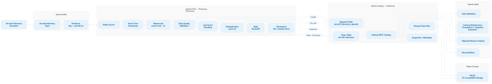
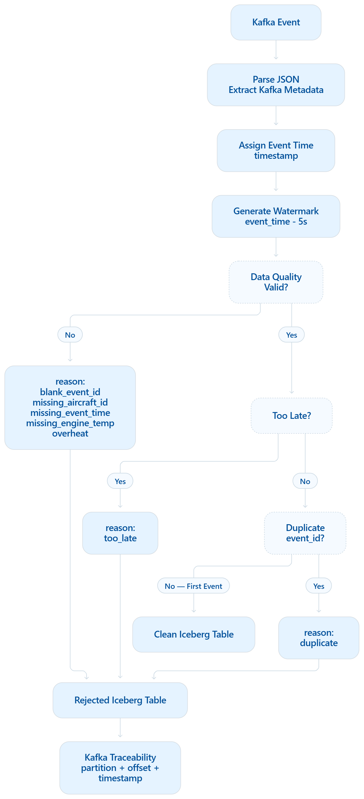

# Real-Time Aircraft Telemetry Lakehouse

> A production-style streaming lakehouse that demonstrates how a
> real-time data pipeline handles **late events, duplicate events,
> invalid sensor readings, stateful processing, checkpoint recovery, and
> traceable rejected data**.

This project simulates aircraft telemetry flowing through **Apache Kafka
→ Apache Flink → Apache Iceberg → Apache Spark**. Rather than focusing
only on the happy path, the pipeline is designed around reliability and
data quality: event-time processing, bounded lateness, deduplication,
rejected-record routing, Kafka traceability, and checkpoint-based state
recovery.

## Architecture



### End-to-end flow

1.  A Python producer generates telemetry for multiple aircraft.
2.  Kafka partitions events using `aircraft_id` as the message key.
3.  Flink SQL reads the stream and applies event-time semantics.
4.  A 5-second watermark tracks event-time progress.
5.  Data-quality rules identify missing fields. `engine_temp_c > 1000` stays in the detail table with `overheat = true`.
6.  Late events are classified as accepted-late or too-late.
7.  Valid events are deduplicated by `event_id`.
8.  The first valid copy is written to `aircraft_telemetry`, rejected rows go to `aircraft_telemetry_rejected`, and each closed event-time minute is written to `aircraft_telemetry_1m`.
9.  Iceberg uses a REST catalog with Parquet data stored in MinIO.
10. Spark reads the same Iceberg tables for validation, reconciliation,
    analysis, and maintenance.

## What this project demonstrates

- **Event-time processing** with a 5-second watermark
- **Bounded lateness** with an additional 15-second acceptance window
- **Stateful deduplication** by `event_id`
- **RocksDB state backend** for Flink stateful processing
- **30-second exactly-once Flink checkpoints**
- **Iceberg snapshot commits coordinated with successful checkpoints**
- **Data-quality routing** instead of silently discarding invalid
  business records
- **Kafka traceability** using partition, offset, and Kafka timestamp
- **Shared Iceberg REST catalog** accessed by Flink as `lakehouse` and
  Spark as `demo`
- **Spark validation and lakehouse maintenance**

## Flink processing flow



The pipeline first evaluates whether a record is valid. Invalid records
receive one or more rejection reasons. Records that pass those checks
are evaluated for lateness and then deduplicated by `event_id`.

---

Condition Result

---

Valid reading, first occurrence of `aviation.aircraft_telemetry`
`event_id`

Same `event_id` seen again within rejected with `reason = duplicate`
the 1-hour state TTL

`engine_temp_c > 1000` stays in `aircraft_telemetry` with `overheat = true`

Event time is more than 15 seconds rejected with `reason = too_late`
behind the current watermark

Event is behind the watermark but main table with `late = true`
within the 15-second tolerance

Blank `event_id`, missing aircraft, missing flight, rejected with the corresponding
event time, or engine temperature reason

---

Multiple validation failures can be preserved on the same row, for
example:

```text
blank_event_id,missing_engine_temp
```

Rejected records retain:

```text
reason
kafka_partition
kafka_offset
kafka_timestamp
```

This makes rejected data observable and traceable back to its Kafka
source position.

## Event time and watermark


The source defines:

```sql
WATERMARK FOR event_time AS event_time - INTERVAL '5' SECOND
```

The project then applies a separate business rule:

```text
event_time >= watermark
    → normal event
    → clean table
    → late = false

watermark - 15s <= event_time < watermark
    → late but accepted
    → clean table
    → late = true

event_time < watermark - 15s
    → too late
    → rejected table
    → reason = too_late
```

The watermark represents **event-time progress**. It does not by itself
mean that every event behind the watermark is automatically rejected.
The additional 15-second rule defines how this pipeline handles late
data.

`table.exec.source.idle-timeout = '10 s'` prevents an idle Kafka
partition from indefinitely holding back the overall watermark.

An event can also be out of order without being late. If its
`event_time` is earlier than an event already seen, but still greater
than or equal to the watermark, `late` stays false. That is the
5-second out-of-orderness bound.

## One-minute windows

`aircraft_telemetry_1m` is one row per `aircraft_id`, `flight_id`, and
event-time minute. The row is emitted when the watermark reaches
`window_end`, and it is not updated after that.

Measured with `python tests/test_semantics.py` on Flink 1.19:

| Case | Detail table | 1-minute aggregate |
|---|---|---|
| Out of order, still at or after the watermark | `late = false` | counted while the minute is open |
| Behind the watermark by at most 15 seconds, minute not yet closed | `late = true` | counted, and included in `late_count` |
| More than 15 seconds behind the watermark | `reason = too_late` | absent |
| Same lateness, but the minute has already closed | `late = true` | the closed row does not change |

A behind-watermark row can still enter an open minute. It cannot revise
a minute whose watermark has already passed `window_end`.

## Stateful deduplication

Valid records are deduplicated using:

```sql
ROW_NUMBER() OVER (
    PARTITION BY event_id
    ORDER BY proc_time ASC
) AS rn
```

The first occurrence is written to the clean table. Later occurrences
within the retained state horizon are routed to the rejected table with:

```text
reason = duplicate
```

Flink uses **RocksDB state** to maintain the state required by stateful
operators such as deduplication.

The project configures:

```sql
SET 'state.backend.type' = 'rocksdb';
SET 'state.backend.incremental' = 'true';
SET 'table.exec.state.ttl' = '1 h';
```

The 1-hour TTL is important: this is **bounded deduplication**, not
permanent global deduplication. After the relevant state expires, an old
`event_id` may be treated as new.

## Checkpoint and failure recovery


Checkpointing and business deduplication solve different problems:

```text
RocksDB state
    → remembers state required by stateful processing

Flink checkpoint
    → snapshots processing state and source progress
    → enables recovery after failure

event_id deduplication
    → handles duplicate business events
```

The job uses:

```sql
SET 'execution.checkpointing.interval' = '30s';
SET 'execution.checkpointing.mode' = 'EXACTLY_ONCE';
SET 'execution.checkpointing.externalized-checkpoint-retention' = 'RETAIN_ON_CANCELLATION';
SET 'state.savepoints.dir' = 'file:///opt/flink/data/savepoints';
SET 'restart-strategy.type' = 'fixed-delay';
SET 'restart-strategy.fixed-delay.attempts' = '30';
SET 'restart-strategy.fixed-delay.delay' = '15 s';
```

Iceberg commits become visible after successful checkpoint-driven
commits, so with this demo configuration a newly processed row is not
necessarily visible to Spark immediately.

A checkpoint is an automatic recovery point. A savepoint is a planned
stop. `scripts/submit_flink_job.ps1` does not restore either one. Resume from
the last savepoint with `.\scripts\savepoint.ps1 stop` and `.\scripts\savepoint.ps1 resume`.

> **Important:** checkpoint mode `EXACTLY_ONCE` configures the Kafka
> source and the Iceberg commit to line up on a checkpoint. It is not,
> by itself, a measured end-to-end guarantee. The TaskManager kill
> below is one measured run. Checkpoint recovery and `event_id`
> deduplication are also different mechanisms: a checkpoint restores
> processing progress, and `event_id` state rejects a repeated business
> event.

### Savepoint recovery

Measured on Flink 1.19.1, parallelism 1, 5 October 2026.

1. Sent `SP-1b0520-A` and `SP-1b0520-B` for flight `AC-101-SP-1b0520`
   into the open minute `2026-10-05 08:15:00`. Both were visible in
   `aircraft_telemetry` before the stop.
2. `flink stop` wrote
   `file:///opt/flink/data/savepoints/savepoint-54cf36-fdbdf0b60bd6`
   and stopped job `54cf36b02ac7f8f39396bab5a4f6e554`.
3. The same SQL was submitted from that savepoint. The new job id is
   `93e50f76223ffcb4f1750c2fcfada0c0`. The JobManager log says it
   started from that savepoint and continued checkpoint ids at 13.
4. Partition 0 `currentOffset` was 33468 before the stop. After restore
   and two new records it was 33472, with `committedOffset` 33473.
   The consumer group was still at the log end on all three partitions
   (0: 33473, 1: 33332, 2: 33331), lag 0. Offsets were not rewound.
5. Replaying `SP-1b0520-A` left one detail row and added one rejected
   row with `reason = duplicate`. The closed minute kept
   `event_count = 2` for A and B. Dedup state and window state survived
   the savepoint.

### TaskManager kill, 100,000 ids

Same job, still parallelism 1. The producer wrote 100,000 unique ids
for flight `REC-a1a588`. Flink was still near the start of that backlog
when the TaskManager container was killed.

| | |
| --- | --- |
| Job id | `93e50f76223ffcb4f1750c2fcfada0c0` (unchanged) |
| Failure | 16:16:35, TaskManager no longer reachable, job `RESTARTING` |
| Resume | 16:16:50, job `RUNNING` after the 15 second restart delay |
| Restored checkpoint | `chk-20` under `file:/opt/flink/data/checkpoints/aircraft-telemetry/93e50f76223ffcb4f1750c2fcfada0c0/chk-20` |
| Source counter at kill | 15,001 `numRecordsIn` on that attempt |
| First Iceberg count after resume | 12,379, then still climbing |
| Produced ids | 100,000 |
| Iceberg rows after catch-up | 100,000 |
| Distinct Iceberg ids | 100,000 |
| Missing | 0 |
| Unexpected | 0 |
| Duplicate rows | 0 |
| Rejected rows for this flight | 0 |

On this run the id set in Iceberg matches the produced set with no
duplicates. That is the result of one TaskManager kill while the
JobManager and the checkpoint files stayed available. It does not
measure JobManager loss, loss of the checkpoint directory, or a second
failure during the catch-up.

The source `numRecordsIn` counter reset when the TaskManager came back.
It later stopped at 87,621. `12,379 + 87,621 = 100,000`, which matches
the final table, but the durable evidence is the id comparison, not
that counter.

A comparison taken while the job was still draining (36,995 rows) showed
63,005 missing ids. Those ids arrived on later checkpoints. Missing rows
during the drain are checkpoint lag.

### Kafka and Flink skew

Measured after raising `aircraft-telemetry` to 12 partitions and
resubmitting a fresh job at parallelism 3
(`d52e60b8761d5178293fdcb4213d62ea`). No savepoint was restored into
the new parallelism. No salting or other mitigation was added.

Load: 60,000 events, 100 aircraft (`AC-S00`–`AC-S99`), `AC-S00` produced
24,000 events (40%). The Kafka key is `aircraft_id`.

Kafka accepted the batch in 25.2 seconds (2,385 records/s). The Flink
source reached 60,000 records 181.6 seconds after the send started, about
330 records/s average.

New records by partition (offset delta, not the historical end offset):

| Partition | Records | Share |
| --- | ---: | ---: |
| 0 | 2,546 | 4.2% |
| 1 | 3,275 | 5.5% |
| 2 | 1,815 | 3.0% |
| 3 | 26,545 | 44.2% |
| 4 | 1,816 | 3.0% |
| 5 | 4,002 | 6.7% |
| 6 | 2,182 | 3.6% |
| 7 | 3,636 | 6.1% |
| 8 | 4,725 | 7.9% |
| 9 | 4,366 | 7.3% |
| 10 | 2,546 | 4.2% |
| 11 | 2,546 | 4.2% |

Partition 3 is the hot key plus the other aircraft whose murmur2 hash
lands there. Historical data is still only on partitions 0–2; those
absolute offsets are not the skew.

Flink assigns partitions round-robin, four per subtask. Source
`numRecordsIn`:

| Subtask | Partitions | Records | Share |
| --- | --- | ---: | ---: |
| 0 | 0, 3, 6, 9 | 35,639 | 59.4% |
| 1 | 1, 4, 7, 10 | 11,273 | 18.8% |
| 2 | 2, 5, 8, 11 | 13,088 | 21.8% |

Subtasks 1 and 2 finished while subtask 0 was still reading the hot
partition. The source imbalance is larger than the hottest partition
because that partition shares a subtask with three others.

`event_id` dedup and the local window aggregate were balanced
(20,124 / 20,194 / 19,682, busiest 33.7%). They are chained on
`event_id`, which is unique. `GlobalWindowAggregate` then received
153 / 96 / 93 records (busiest 44.7%). That is the keyed shuffle after
local aggregation, not the raw event stream. Its Iceberg writer was
still at 0 because every event shared one open minute, so
`aircraft_telemetry_1m` was not part of this measurement.

Backpressure on the source and on the global window was `ok` for all
13 samples taken during the 25 second produce. This run did not show
backpressure. It did show a long single-subtask tail.

## Data model

Example telemetry event:

```json
{
  "event_id": "7c2e0d2a-4f1b-4c0a-9a11-0b5e2d8c6f10",
  "aircraft_id": "AC-101",
  "flight_id": "AC-101-20261005-01",
  "event_time": "2026-10-05T08:15:00.000Z",
  "latitude": 32.947,
  "longitude": 120.752,
  "altitude_ft": 30276,
  "ground_speed_kts": 393,
  "vertical_speed_fpm": 2577,
  "heading_deg": 342.1,
  "engine_temp_c": 790,
  "oil_pressure_psi": 55.1,
  "fuel_flow_kg_h": 3100,
  "fuel_remaining_kg": 16142,
  "outside_air_temp_c": -44.9
}
```

`aircraft_id` and `flight_id` are the join keys for a later analytics project. This repository does not build flight, aircraft, airport, or weather tables.

Changing units and column names does not fit in place on the old demo tables. `scripts/migrate_iceberg_v2.ps1` drops `aircraft_telemetry` and `aircraft_telemetry_rejected` on purpose. Normal `scripts/submit_flink_job.ps1` only creates missing tables. It does not drop them, and it refuses to start a second job of the same name.

`event_time` comes from the JSON `timestamp` field.

The producer also injects test anomalies:

Fault Example behavior

---

Late moves event time backwards
Duplicate reuses a previous `event_id`
Overheat generates `engine_temp > 1000`

The temperature threshold is a **demo data-quality rule**, not an
aviation safety specification.

## Iceberg storage design

Flink writes two Iceberg tables:

```text
lakehouse.aviation.aircraft_telemetry
lakehouse.aviation.aircraft_telemetry_rejected
```

Spark accesses the same physical tables through its catalog name:

```text
demo.aviation.aircraft_telemetry
demo.aviation.aircraft_telemetry_rejected
```

Both catalogs point to the same Iceberg REST catalog and MinIO-backed
warehouse.

The tables use:

- Iceberg format v2
- Parquet
- Zstandard compression
- Iceberg snapshots and metadata
- MinIO as S3-compatible object storage

## Design decisions

### Why Kafka?

Kafka decouples telemetry producers from downstream processing and
provides partitioned, replayable event transport. Using `aircraft_id` as
the Kafka key keeps events for the same aircraft on the same Kafka
partition.

### Why event time?

Telemetry may arrive out of order because of network delay, buffering,
or upstream retries. Processing only by arrival time would hide that
distinction.

### Why a watermark?

The watermark gives Flink a notion of event-time progress while allowing
bounded out-of-order arrival.

### Why deduplicate by `event_id`?

Kafka ordering and business uniqueness are different concerns.
`aircraft_id` controls Kafka partition routing, while `event_id`
identifies the business event used for deduplication.

### Why RocksDB state?

Deduplication is stateful. Flink must remember previously observed event
IDs during the configured state horizon. RocksDB provides a state
backend suitable for maintaining larger keyed state than a purely
heap-oriented approach.

### Why Iceberg instead of plain Parquet?

Parquet is the physical file format. Iceberg adds table metadata,
snapshots, transactional table commits, schema evolution capabilities,
and table-level management on top of those files.

### Why keep rejected data?

Invalid or severely late data should remain inspectable instead of
silently disappearing. The rejected table records both the reason and
Kafka source metadata, making investigation and reconciliation possible.

### Why Spark?

Spark provides an independent consumer of the Iceberg tables for
validation, reconciliation, rejected-reason analysis, and maintenance
operations such as data-file compaction and snapshot expiration.

## Repository layout

```text
.
├── src/
│   ├── telemetry_event.py          shared V2 message and flight track
│   ├── producers/
│   │   ├── data_generator.py
│   │   ├── send_test_event.py
│   │   └── send_bulk_events.py
│   └── simulator/
│       └── flink_job.py            local stand-in, not the cluster job
├── flink/
│   └── flink_job.sql               cluster job
├── scripts/
│   ├── submit_flink_job.ps1
│   ├── savepoint.ps1
│   └── migrate_iceberg_v2.ps1      one-time table reset
├── tests/
│   ├── test_semantics.py
│   ├── test_savepoint.py
│   ├── test_recovery_100k.py
│   └── test_skew.py
├── docs/
│   ├── images/
│   └── sql/
│       └── spark.sql
├── requirements.txt
└── README.md
```

## Run the local simulation

No Kafka, Flink, or Spark is required for the lightweight simulation:

```powershell
python -m pip install -r requirements.txt
python src/producers/data_generator.py --no-kafka
python src/simulator/flink_job.py --source file
```

Or:

```powershell
python src/producers/data_generator.py --interval 0.5 --anomaly-rate 0.05 --hot-rate 0.03
python src/simulator/flink_job.py --ooo 5 --lateness 15 --temp-limit 1000
```

The local Python implementation is useful for demonstrating the
processing semantics without running the complete infrastructure.

## Run the real Flink SQL pipeline

`flink/flink_job.sql` expects the following services on the same Docker
network:

---

Service Address

---

Kafka `kafka:19092`, topic
`aircraft-telemetry`

Flink 1.19 JobManager `flink-jobmanager`, UI
`http://localhost:8081`

Iceberg REST `http://iceberg-rest:8181`,
warehouse `s3://warehouse/`

MinIO `http://minio:9000`

Spark SQL container `spark-iceberg`, catalog
`demo`

---

Submit the Flink SQL job:

```powershell
.\scripts\submit_flink_job.ps1
```

The submit script refuses to start a second
`lakehouse-aircraft-telemetry` job. Cancel the running job explicitly
before submitting again. Submit does not drop Iceberg tables and does
not restore a savepoint, so a fresh submit starts deduplication state
over.

```powershell
.\scripts\savepoint.ps1 stop
.\scripts\savepoint.ps1 resume
```

`stop` takes a savepoint and writes the path to `savepoint-path.txt`.
`resume` submits the current SQL from that path. Do not change
parallelism between those two commands. The skew run below was a fresh
submit at parallelism 3, not a restore of the parallelism-1 savepoint.

## Test scenarios

```powershell
python tests/test_semantics.py
python tests/test_savepoint.py
python tests/test_recovery_100k.py
python tests/test_skew.py
```

`test_savepoint.py` stops the running job. `test_recovery_100k.py`
kills `flink-taskmanager` and starts it again. `test_skew.py` expects
12 topic partitions and Flink parallelism 3. The numbers from the
5 October 2026 runs are in **Checkpoint and failure recovery** and
**Kafka and Flink skew**.

That check generates one correlated flight locally, then sends a scripted
Kafka sequence and compares the detail table, the reject table, and
`aircraft_telemetry_1m`.

Send controlled events one at a time:

```powershell
python src/producers/send_test_event.py normal
python src/producers/send_test_event.py duplicate
python src/producers/send_test_event.py overheat
python src/producers/send_test_event.py watermark
python src/producers/send_test_event.py too_late
```

Recommended order for the controlled demo:

```text
1. normal
2. duplicate
3. overheat
4. watermark
5. wait for watermark progress / idle-partition handling
6. too_late
7. wait for the next Iceberg checkpoint commit
8. query both Iceberg tables from Spark
```

Query clean data:

```powershell
docker exec spark-iceberg spark-sql -e "SELECT * FROM demo.aviation.aircraft_telemetry ORDER BY ingest_time DESC LIMIT 20"
```

Query rejected data:

```powershell
docker exec spark-iceberg spark-sql -e "SELECT event_id, aircraft_id, event_time, reason, kafka_partition, kafka_offset FROM demo.aviation.aircraft_telemetry_rejected ORDER BY ingest_time DESC LIMIT 20"
```

Summarize data-quality outcomes:

```sql
SELECT
    reason,
    COUNT(*) AS rejected_count
FROM demo.aviation.aircraft_telemetry_rejected
GROUP BY reason
ORDER BY rejected_count DESC;
```

## Iceberg maintenance

Frequent streaming commits can create small files and metadata over
time. Spark can perform maintenance operations such as:

```sql
CALL demo.system.rewrite_data_files('aviation.aircraft_telemetry');
```

and snapshot expiration:

```sql
CALL demo.system.expire_snapshots(
    'aviation.aircraft_telemetry',
    TIMESTAMP '2026-09-25 00:00:00'
);
```

For a production deployment, maintenance should be scheduled rather than
run manually.

## Technology stack

Layer Technology

---

Producer Python
Event streaming Apache Kafka
Stream processing Apache Flink 1.19 / Flink SQL
Stateful processing RocksDB
Table format Apache Iceberg v2
File format Parquet + Zstandard
Catalog Iceberg REST Catalog
Object storage MinIO / S3-compatible
Analytics & maintenance Apache Spark

## Production considerations

This repository is intentionally a focused local engineering demo rather
than a complete production platform. A production deployment would
typically strengthen:

- durable remote checkpoint storage instead of local `file:///...`
- high availability and distributed deployment
- metrics, dashboards, and alerting
- schema governance and evolution strategy
- authentication, authorization, and secret management
- dead-letter handling for records that fail before business
  validation
- automated Iceberg maintenance
- deployment and integration testing

Keeping these concerns explicit avoids presenting a local portfolio
project as if it already solved every production requirement.

## Interview talking points

This project is designed to support deeper engineering discussion:

- Why event time instead of processing time?
- How does a watermark handle out-of-order events?
- Why is late-event policy separate from the watermark definition?
- What state does deduplication require?
- What happens when the RocksDB state TTL expires?
- What does a Flink checkpoint protect?
- How is checkpoint recovery different from business deduplication?
- Why use Iceberg instead of writing Parquet files directly?
- How can a rejected record be traced back to Kafka?
- What maintenance problems can streaming writes create in Iceberg?

## Next steps

The current version focuses on **reliable streaming ingestion and
data-quality enforcement**. Natural follow-up iterations are:

1.  **Observability** --- Prometheus + Grafana
2.  **Orchestration** --- Airflow for validation and Iceberg maintenance
3.  **DLQ / raw preservation** --- preserve records that fail before
    business validation
4.  **Cloud deployment** --- move storage/checkpoints to cloud object
    storage and deploy the pipeline on managed infrastructure

---

### Project focus

**Reliable real-time ingestion + stateful stream processing +
data-quality enforcement + lakehouse persistence.**
