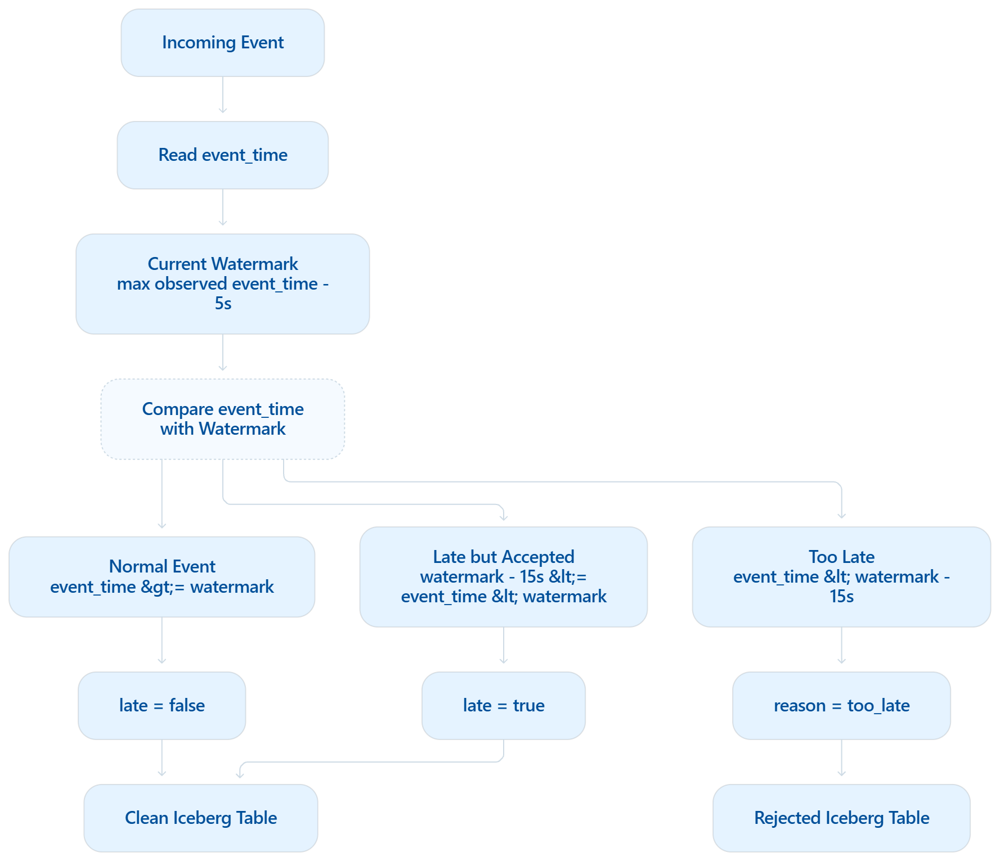

# Event time, lateness, dedup, and the 1-minute window



Flink 1.19 SQL, job `flink/flink_job.sql`. The numbers below are the behavior measured by `python tests/test_semantics.py` (15 passed, 0 failed), not an assumption about allowed lateness.

## Watermark

```sql
WATERMARK FOR event_time AS event_time - INTERVAL '5' SECOND
```

The watermark is event-time progress: the latest event time seen, minus 5 seconds. An event earlier than one already seen, but still at or after the watermark, is out of order and not late. `late` stays false, and an open minute still counts it.

`table.exec.source.idle-timeout = 10 s` stops an idle Kafka partition from holding the watermark forever.

## Late policy

The 15-second bound is a separate business rule. It is not the watermark.

| Event time | Detail table | 1-minute aggregate |
| --- | --- | --- |
| At or after the watermark | `late = false` | Counted while the minute is open |
| From watermark − 15s up to, but not including, the watermark, minute still open | `late = true` | Counted, including `late_count` |
| Older than watermark − 15s | Rejected, `reason = too_late` | Absent |
| Within 15 seconds, but the minute has already closed | `late = true` | The closed row does not change |

A row behind the watermark can still enter a minute while `watermark < window_end`. After the watermark reaches `window_end`, that aggregate row is final. A later within-15-second event for that minute stays on `aircraft_telemetry` only.

`late_count` is `COUNT` of rows in the minute with `late = true`.

## One-minute aggregate

`aircraft_telemetry_1m` is a 1-minute `TUMBLE` on `event_time`, grouped by `aircraft_id` and `flight_id`. Columns include event count, average and max ground speed, altitude, and engine temperature, average fuel flow, min and max fuel remaining, and `late_count`.

The row is emitted once, when the watermark reaches `window_end`. The sink is append-only. The next minute does not emit until its own end is reached.

On the measured flight, the closed minute had `event_count = 5` and `late_count = 1`: four on-time or out-of-order points plus one accepted-late point. A duplicate of the first id was not counted twice. A later point inside the 15-second band arrived after the minute had closed and did not change `event_count`.

## Dedup

```sql
ROW_NUMBER() OVER (
    PARTITION BY event_id
    ORDER BY proc_time ASC
)
```

`rn = 1` is the detail row and the input to the window. `MATCH_RECOGNIZE` emits each later copy as `reason = duplicate`.

State TTL is 1 hour (`table.exec.state.ttl`). This is bounded dedup. After the state expires, the same `event_id` can be accepted as new.

## Overheat

`engine_temp_c > 1000` is not a reject. The row stays in `aircraft_telemetry` with `overheat = true`. The threshold is a demo rule.

## Reject reasons

Blank `event_id`, missing `aircraft_id`, missing `flight_id`, missing `event_time`, missing `engine_temp_c`, and `too_late`. More than one can be stored on the same row, comma-separated. Rejected rows also store `kafka_partition`, `kafka_offset`, and `kafka_timestamp`.
