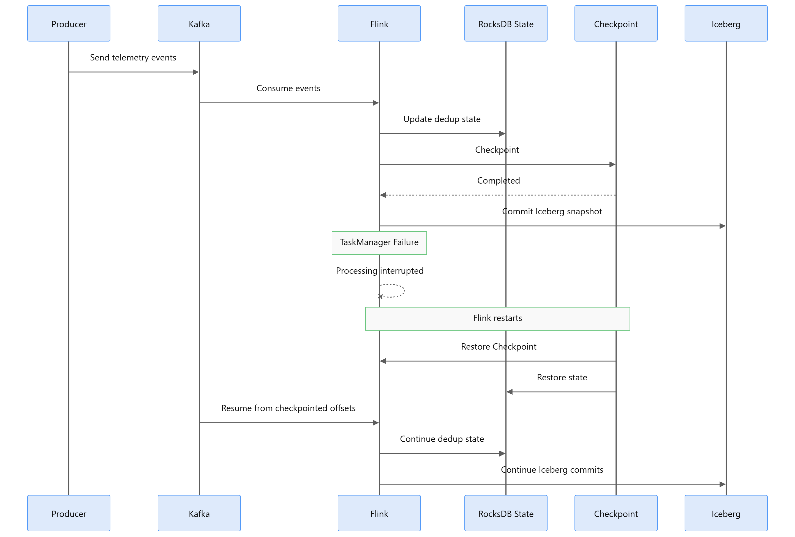

# Checkpoint recovery and savepoint recovery



These are different operations.

| | Checkpoint | Savepoint |
| --- | --- | --- |
| Purpose | Automatic recovery after a failure | Planned stop and resume |
| Who starts it | Flink, every 30 seconds | `.\scripts\savepoint.ps1 stop` |
| Resume | Same job id, restart strategy, last successful checkpoint | New submission of the same SQL with `execution.savepoint.path` |
| What this repo measured | TaskManager kill during a 100,000-id backlog | Stop, restore, replay one known `event_id` |

`scripts/submit_flink_job.ps1` does not restore a checkpoint or a savepoint. A fresh submit starts dedup state over. Do not restore a savepoint onto a different parallelism. The skew job was a fresh submit at parallelism 3, not a restore of the parallelism-1 savepoint.

Checkpoint mode is `EXACTLY_ONCE`. That configures the Kafka source and the Iceberg commit to complete together. Iceberg snapshots become visible to Spark after that commit, so a row can be processed and still be invisible for about one checkpoint interval. The mode is not, by itself, proof of end-to-end exactly-once delivery.

RocksDB state, a checkpoint, and `event_id` dedup also answer different questions. RocksDB holds operator state. A checkpoint snapshots that state and the source offsets so a restart can continue. Dedup decides whether a business event has already been accepted inside the 1-hour TTL.

Job settings used for both runs:

```sql
SET 'execution.checkpointing.interval' = '30s';
SET 'execution.checkpointing.mode' = 'EXACTLY_ONCE';
SET 'execution.checkpointing.externalized-checkpoint-retention' = 'RETAIN_ON_CANCELLATION';
SET 'state.savepoints.dir' = 'file:///opt/flink/data/savepoints';
SET 'restart-strategy.type' = 'fixed-delay';
SET 'restart-strategy.fixed-delay.attempts' = '30';
SET 'restart-strategy.fixed-delay.delay' = '15 s';
```

Checkpoints are on the shared container volume `file:///opt/flink/data/checkpoints/aircraft-telemetry`. The JobManager stays up if only the TaskManager container is killed.

## Savepoint

Parallelism 1. Flight `AC-101-SP-1b0520`, minute `2026-10-05 08:15:00`.

1. `SP-1b0520-A` and `SP-1b0520-B` were in `aircraft_telemetry` before the stop.
2. `flink stop` wrote `file:///opt/flink/data/savepoints/savepoint-54cf36-fdbdf0b60bd6` and stopped job `54cf36b02ac7f8f39396bab5a4f6e554`.
3. The same SQL was submitted from that path. New job id `93e50f76223ffcb4f1750c2fcfada0c0`. The JobManager log shows the restore, and checkpoint ids continued at 13.
4. Partition 0 `currentOffset` was 33468 before the stop. After restore and two new records it was 33472, committed at 33473. Consumer-group lag was 0 on the three partitions that existed then (offsets 33473, 33332, 33331). Offsets were not rewound. Idle partitions can report reader `currentOffset = -1` even when the group offset is intact; the group end offset is the check that matters.
5. Replaying `SP-1b0520-A` left a single detail row and added `reason = duplicate`. The closed minute stayed `event_count = 2`.

Kafka progress, dedup state, and window state survived the planned restart.

## TaskManager kill, 100,000 ids

Same job, still parallelism 1. Producer wrote 100,000 unique ids for flight `REC-a1a588`. The TaskManager was killed while Flink was still early in that backlog.

| | |
| --- | --- |
| Job id | `93e50f76223ffcb4f1750c2fcfada0c0`, unchanged |
| Failure | 16:16:35, TaskManager unreachable, job `RESTARTING` |
| Resume | 16:16:50, `RUNNING`, after the 15-second restart delay |
| Checkpoint | `chk-20` at `file:/opt/flink/data/checkpoints/aircraft-telemetry/93e50f76223ffcb4f1750c2fcfada0c0/chk-20` |
| Source counter at kill | 15,001 `numRecordsIn` on that attempt |
| First Iceberg count after resume | 12,379, then still climbing |

After the count stopped changing:

| | |
| --- | ---: |
| Produced | 100,000 |
| Iceberg rows | 100,000 |
| Distinct ids | 100,000 |
| Missing | 0 |
| Unexpected | 0 |
| Duplicate rows | 0 |
| Rejected rows for this flight | 0 |

For this TaskManager failure, the id set in Iceberg matches the produced set with no duplicates. The JobManager and the checkpoint directory were still there. The run does not cover JobManager loss, deletion of checkpoint files, or a second failure during catch-up.

`numRecordsIn` reset when the TaskManager came back and later read 87,621. `12,379 + 87,621 = 100,000`, which is consistent with the committed prefix plus the restored tail, but the id comparison is the evidence.

A comparison at 36,995 visible rows reported 63,005 missing ids. Those ids arrived on later checkpoints. A short wait looks like data loss because Iceberg only publishes a snapshot on a successful checkpoint, and parallelism 1 drained this backlog slower than Kafka accepted it.
